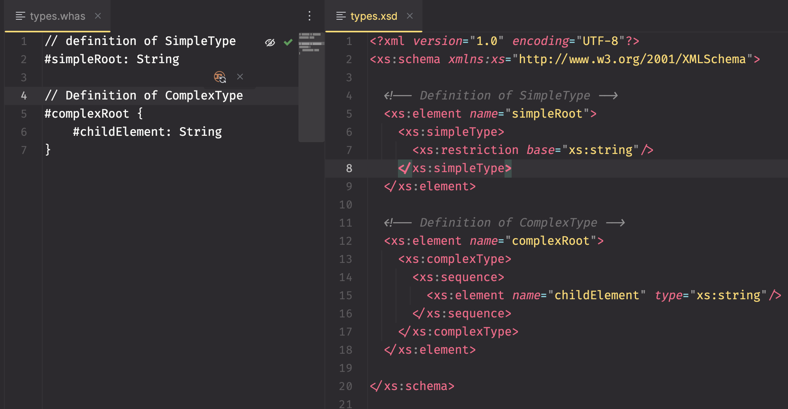

# 🐳 WHALE SCHEMA DEFINITION

💧💧💧💧💧💧💧💧💧💧💧💧💧💧💧💧💧💧💧💧💧💧💧💧💧💧💧💧

Whale Schema Definition, or WHAS, is an XML schema language created by Luuk de Waal Malefijt.
The primary objective is to simplify the process of crafting XML schemas,
enabling junior engineers to work with schemas confidently without relying on specialized GUI tools and editors like Oxygen.

Designed with a focus on simplicity, readability, and an intuitive Domain-Specific Language (DSL),
WHAS streamlines the creation of XML schemas.
The intention behind developing this schema language is to provide junior engineers with a straightforward tool for
generating XML schemas.
This, in turn, opens up the possibility of creating custom Fonto instances for specific internal use cases without
requiring extensive expertise or additional tooling.

WHAS is a practical solution aimed at breaking down barriers,
making XML schema development accessible to junior engineers,
and facilitating the creation of Fonto instances tailored to the unique requirements of internal applications.

## Design goals

- should be compilable to XML Schema and/or Fonto compiled schema
- should be simple to write, and simple to read
- should feel like an intuitive DSL with as little boilerplate as possible

## Simple Example



## Roadmap

- [x] language specification (01/12)
- [x] parsing syntax to AST (03/12)
- [x] compiler (09/04)
- [x] export to Fonto compiled schema JSON (11/04)
- [x] command line interface (11/04)
- [x] CLI arg for specifying target Fonto compiler version (12/04)
- [x] @import statements (02/05)
    - [x] glob pattern support for importing multiple files
    - [x] Schema Manager with type counting across imports
    - [x] fix recursion, allow cycled imports
- [ ] move attribute definitions to the block-level instead of as same-level headers
- [ ] file watcher
- [ ] support for namespaces
- [ ] support for setting default values
- [ ] generics for types (like List<Li>)
- [ ] postfix occurrence modifiers for splat types
- [ ] recursive group splatting
- [ ] command for linting input XML file against schema, like xmllint
- [ ] command for generating schema-valid XML templates
- [ ] "decompile" XSD Schema to WHAS
- [ ] more extensive 'examples' folder
- [ ] have WHAS variants for:
    - [ ] DITA
    - [ ] NISO-STS
    - [ ] S1000D

## Inspirations

- DTD
- TypeScript
- GraphQL
- Graph data structures
- Fonto compiled schema JSON format
- Markdown
- Dhall

## Why is it called 'Whale' Schema Definition?

It's a wordplay on my surname ('Waal') and that <xs:choice> is a "Wahl" in German.
This allows us to use the extension '.whas' from "\[WHA\]le \[S\]chema", which is a pun
on the purpose of XSD schema's, where the 'what!?!?!?' question occurs regularly.

## Syntax Rules

### Documentation

comments are written using two slashes inside schema definitions and support Markdown:

    // this is a **comment**

or within Markdown backticks (without the escape symbol) such as

    $```
        #Markdown header
    $```

or using wildcard comment annotation:

    /*
        hello comment life
    */

### Terms

| Field                   | Description                                                                                                         |
|-------------------------|---------------------------------------------------------------------------------------------------------------------|
| **Element**             | an XML element                                                                                                      |
| **Attribute**           | an XML attribute                                                                                                    |
| **Type**                | the type definition of element contents. Named Group                                                                |
| **Block**               | the bracket block { .. } denoting a nested element definition                                                       |
| **Duplicity modifier**  | a symbol appearing after the element name to indicate how often the element is allowed to repeat                    |
| **Occurrence modifier** | a symbol appearing before a block declaration to indicate the ordering that the containing elements are expected in |
| **Group**               | elements in a Block that are either defined inline or assigned as a separate Type                                   |

### Naming convention

Element names and attribute names are always lowercase.
Names of types are always capitalized.

### elements

elements are defined using a hash symbol and then the element name
like so:

    #element

if elements should be able to contain nested data, follow the declaration
with curly brackets to create a block:

    #element { .. }

### Typing

Element definitions support a newline-oriented sequence
of 'element: Type' pairs. The colon is _optional_ when a block is provided as type:

    #mandatory: String // mandatory colon

    #optional: { .. }
    #optional  { .. } // optional colon

When multiple type definitions should be on a single line,
separate them by a comma:

    #one-liner { #first: String, #second: String }

##### Data Types / Primitives (XSD => .whas primitive)

We support most XSD primitives for interoperability.

- xsd:string => String,
- xsd:anyURI => URI,
- xsd:date => Date,
- xsd:dateTime => DateTime,
- xsd:dateTimeStamp => DateTimestamp,
- xsd:time => Time,
- xsd:duration => Duration,
- xsd:boolean => Bool,
- xsd:integer => Int,
- xsd:float => Float,
- xsd:double => Double,
- xsd:short => Short,
- xsd:decimal => Decimal,
- xsd:ID => ID,
- xsd:IDREF => IDRef,
- xsd:IDREFS => [IDRef],
- xsd:language => Lang,
- xsd:Name => Name,
- xsd:NCName => NoColName,
- xsd:negativeInteger => -Int,
- xsd:nonNegativeInteger => +Int,
- xsd:token => Token,
- xsd:NMTOKEN => NameToken,
- xsd:NMTOKENS => [NameToken],

### Modifiers

#### Duplicity modifiers

An element may be specified as:

- ... **optional** (0..1) by postfixing it with a '?' like in TypeScript.
- ... **zero-or-more** (0..) by postfixing it with a '*' like in DTD.
- ... **one-or-more** (1..) by postfixing it with a '+' like in DTD.
- ... **limited in its repeating** by postfixing a range like [0..3] or [5]

  #element-optional?: String,
  #element-zero-or-more*: String,
  #element-repeat[5]: String,

#### Occurrence modifiers

By default, a nested element definition behaves like ```<xs:sequence>```, where every element
must occur _in order_. To configure the block to behave like a ```<xs:choice>```, where only a single
element must be chosen, prefix the block with a block modifier like so:

    #choice-block-element ?{ #choice1: String, #choice2: String }

To configure the block to behave like an ```<xs:all>```, where all elements must be present (subject to their modifiers)
_irregardless of ordering_, use the exclamation prefix:

    #all-present !{ #must1: String, #must2: String }

#### Mixed content modifier

To configure a block to allow mixed elements and plaintext, use the 'mixed content modifier':

    #allow-mixed-content: x{ .. }

This modifier can ironically be mixed with the occurrance modifier:

    #allow-mixed-content: ?x{ .. }
    #allow-mixed-content: x?{ .. }

### Groups

Groups are created by encapsulating elements in a block without assigning
the block as an element. The group can have occurrence modifiers:

    #element {
        #sub: String

        ?{
            #choice1: String
            #choice2: String
        }
    }

### Type definitions

Instead of only using the built-in XSD types, custom types can be defined and reused.
To do so, define a **top-level** capitalized type name with a block:

    NewType { .. }

A Type can be used for element declarations:

    #element: NewType

But types can also function like ```<xs:group>``` and be splatted into a structure:

    #element {
        #field1: String,

        ...NewType

        #field3: String
    }

Type definitions still support occurrence modifiers:

    NewType: ?{ #choice1: String, #choice2: String }

So these are the same:

    #element {
        ...NewType
    }

    #element {
        ...?{ #choice1: String, #choice2: String }
    }

Splatted types also support occurrence modifiers, but these are appended to the expression:

    #element {
        ...NewType?
    }

    #element {
        ...NewType*
    }

    #element {
        ...NewType[0..3]
    }

#### Generics

To prevent having to statically define all variants of types under different contexts,
type definitions support generics that can be expanded inside the block. All type arguments
are optional by default

    // list definition
    List(itemType) {
        #item+: ListItem(itemType)
    }

    // type definition of a list item with a generic content type
    ListItem(content) {
        // expand the 'content' Type argument in this position
        ...content

        #list?: List
    }

    ..

    #element {

        #milestones: List(Milestone)

        #plaintextlist: List(x{}) //empty block with mixed content

    }

#### Aliases

Type definitions may be aliased:

    // element with type definition
    #element: MyType

    // alias type
    MyType: MyWrapperType

    // alias type
    MyWrapperType: String

#### Abstract Types

Types can be marked as abstract, meaning they cannot be directly instantiated but can serve as base types for other types to extend. Use the 'a' modifier after the type name:

    // Abstract base type
    Vehicle: a{
        #manufacturer: String
    }

    // Cannot create elements directly of type Vehicle
    // #vehicle: Vehicle  // This would be invalid in XML

Abstract types are commonly used with inheritance to define common structure that derived types will inherit.

#### Inheritance

Types can extend other types using the `<` operator, inheriting all fields from the base type:

    // Base type
    Vehicle {
        #manufacturer: String
    }

    // Derived type that extends Vehicle
    Car < Vehicle {
        #num-doors: Int
        #model: String
    }

    // Car now has all fields from Vehicle plus its own
    #my-car: Car
    // Will have: manufacturer, num-doors, model

The most common pattern combines abstract types with inheritance:

    // Abstract base type (cannot be instantiated)
    Vehicle: a{
        #manufacturer: String
    }

    // Concrete derived type
    Car < Vehicle {
        #num-doors: Int
        #model: String
    }

    // Valid element declaration
    #car: Car

When exported to XSD, inheritance is represented using `xs:extension` within `xs:complexContent`, and abstract types use the `abstract="true"` attribute.

#### Extend / Redefine

todo: still needed if we have generic args?

### Core Types

A few Types are defined by default in the compiler:

    // plaintext; Empty Block with mixed type so that text nodes are allowed
    // but no subelements are defined
    Plain x{}

### Attributes

Element attributes can be defined in two places.

Over **inline element declarations**:

    @name: String
    #element: String

Over toplevel block type definitions:

    @name: String
    MyString x{

    }

The typing for attribute declarations is optional and default to String

    @name: String
    @name //equivalent

Attribute typing only supports primitives and regexes.

    @name: String
    @age: Int
    @complex: /(this|orthis|orthat)/

Type annotations that resolve to Blocks are compile errors:

    @attr: MyType // error

    MyType { .. }

Attributes may contain a postfix optionality modifier:

    @name?

    @attr: Int

Attribute definitions are ignored for Types that are splatted into element declarations.

    @name: String
    MyString x{}

    #element {
        ...MyString // attribute definition @name is lost
    }

Attributes defined on Type blocks are merged with those on #element declarations.
The arguments on #element declarations take precedence.

    @name: Int
    MyType: {}

    @name: String
    #element: MyType

    // @name will be String

### Inclusions

Definition files can be split up and may be included using import
statements at the top of the file. Note that the filename does not need to be enclosed
as a string like in JS.

    // include all Types and elements from other.whas
    use * from ./other.whas

    // or even shorter
    use ./other.whas

    // partial inclusions are done using a Javascript-like import syntax
    use { MyCustomType, YourType, #our-element } from ./another.whas

    // alias types and elements to get around coinflicts with locally named elements
    use { YourType as MyType } from ./our-stuff.whas

#### Glob Patterns

Import paths support glob patterns using wildcards (`*`) to import from multiple files at once:

    // import all .whas files in a directory
    import "./schemas/*"

    // wildcard import from all matching files
    import * from "./common/*"

    // selective imports from multiple files
    import {SharedType, HelperType} from "./utils/*"

    import from "./components/*" {
        Button,
        Input,
        Form
    }

    // glob patterns work with partial paths too
    import "./glob*"  // matches glob1.whas, glob2.whas, etc.

Glob patterns are resolved relative to the current file's directory and will import all matching `.whas` files.

    // todo: good idea?
    @from: ./other.whas
    #use { MyCustomType, YourType, #our-element }
